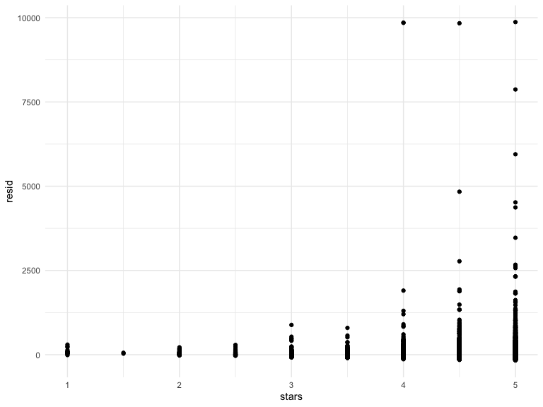
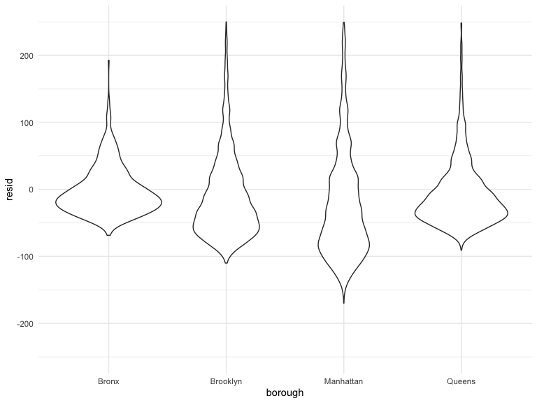

Linear Model
================
Zhaohua Chunyu
2022-11-20

Load NYC Airbnb data.

``` r
data("nyc_airbnb")
nyc_airbnb =
  nyc_airbnb %>% 
  mutate(
    stars = review_scores_location / 2) %>% 
  rename(
    borough = neighbourhood_group
  ) %>% 
  filter(borough != "Staten Island") %>% 
  select(price, stars, borough, neighbourhood, room_type)
```

## Fit the first model

``` r
fit = lm(price ~ stars + borough, data = nyc_airbnb)

fit %>% 
  broom::tidy() %>% 
  mutate(
    term = str_replace(term, "borough", "Borough:")
  ) %>% 
  select(term, estimate, p.value) %>% 
  knitr::kable(digits = 2)
```

| term              | estimate | p.value |
|:------------------|---------:|--------:|
| (Intercept)       |   -70.41 |    0.00 |
| stars             |    31.99 |    0.00 |
| Borough:Brooklyn  |    40.50 |    0.00 |
| Borough:Manhattan |    90.25 |    0.00 |
| Borough:Queens    |    13.21 |    0.15 |

Let’s change reference category.

``` r
fit =
  nyc_airbnb %>%  
  mutate(borough = fct_infreq(borough)) %>% 
  lm(price ~ stars + borough, data = .)

fit %>% 
  broom::tidy() %>% 
  mutate(
    term = str_replace(term, "borough", "Borough:")
  ) %>% 
  select(term, estimate, p.value) %>% 
  knitr::kable(digits = 2)
```

| term             | estimate | p.value |
|:-----------------|---------:|--------:|
| (Intercept)      |    19.84 |     0.1 |
| stars            |    31.99 |     0.0 |
| Borough:Brooklyn |   -49.75 |     0.0 |
| Borough:Queens   |   -77.05 |     0.0 |
| Borough:Bronx    |   -90.25 |     0.0 |

``` r
fit %>% 
  broom::glance() %>% 
  select(AIC)
```

    ## # A tibble: 1 × 1
    ##       AIC
    ##     <dbl>
    ## 1 404237.

## Diagnostics

``` r
modelr::add_residuals(nyc_airbnb, fit) %>% 
  ggplot(aes(x = stars, y = resid)) +
  geom_point()
```



``` r
nyc_airbnb %>% 
  modelr::add_residuals(fit) %>% 
  ggplot(aes(x = borough, y = resid)) +
  geom_violin() +
  ylim(-250, 250)
```



## Hypothesis testing

one coefficient(let’s say `stars`).

``` r
fit %>% 
  broom::tidy()
```

    ## # A tibble: 5 × 5
    ##   term            estimate std.error statistic   p.value
    ##   <chr>              <dbl>     <dbl>     <dbl>     <dbl>
    ## 1 (Intercept)         19.8     12.2       1.63 1.04e-  1
    ## 2 stars               32.0      2.53     12.7  1.27e- 36
    ## 3 boroughBrooklyn    -49.8      2.23    -22.3  6.32e-109
    ## 4 boroughQueens      -77.0      3.73    -20.7  2.58e- 94
    ## 5 boroughBronx       -90.3      8.57    -10.5  6.64e- 26

``` r
fit_null =lm(price ~ stars, data = nyc_airbnb)
fit_alt = lm(price ~ stars + borough, data = nyc_airbnb)

anova(fit_null, fit_alt) %>% 
  broom::tidy()
```

    ## # A tibble: 2 × 7
    ##   term                    df.residual       rss    df   sumsq stati…¹    p.value
    ##   <chr>                         <dbl>     <dbl> <dbl>   <dbl>   <dbl>      <dbl>
    ## 1 price ~ stars                 30528    1.03e9    NA NA          NA  NA        
    ## 2 price ~ stars + borough       30525    1.01e9     3  2.53e7    256.  7.84e-164
    ## # … with abbreviated variable name ¹​statistic
