cross_validation
================
Zhaohua Chunyu
2022-11-27

## Step one

Cross validation “by hand” on simulated data.

``` r
nonlin_df = 
  tibble(
    id = 1:100,
    x = runif(100, 0, 1),
    y = 1 - 10 * (x - .3) ^ 2 + rnorm(100, 0, .3)
  )

nonlin_df %>% 
  ggplot(aes(x = x, y = y)) + 
  geom_point()
```

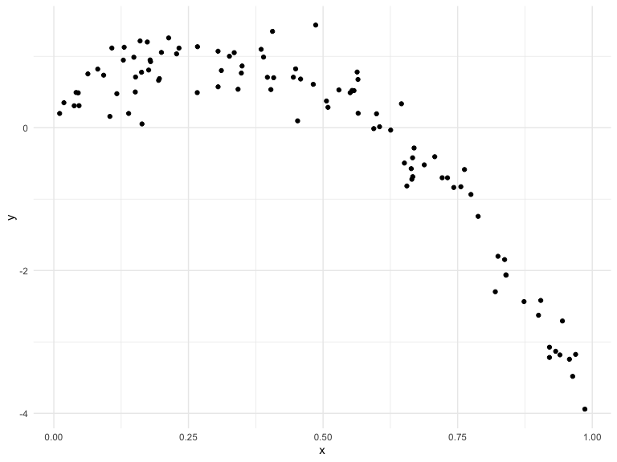

Let’s get this “by hand”

``` r
## randomly divide train_df and test_df
train_df = sample_n(nonlin_df, 80) 
test_df= anti_join(nonlin_df, train_df, by = "id") 
```

``` r
## train_df and test_df graph on top of one another
train_df %>% 
  ggplot(aes(x = x, y = y)) +
  geom_point() +
  geom_point(data = test_df, color = "red")
```

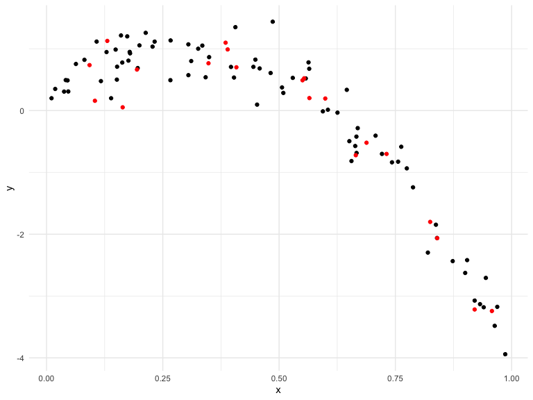

Let’s try to fit three models

``` r
linear_mod = lm(y ~ x, data = train_df) ## linear model
smooth_mod = mgcv::gam(y ~ s(x), data = train_df)
wiggly_mod = mgcv::gam(y ~ s(x, k = 30), sp = 10e-6, data = train_df) ## give too much nonlinearity
```

Let’s see the results

``` r
## linear_mod
train_df %>% 
  add_predictions(linear_mod) %>% 
  ggplot(aes(x = x, y = y)) +
  geom_point() +
  geom_line(aes(y = pred), color = "red")
```

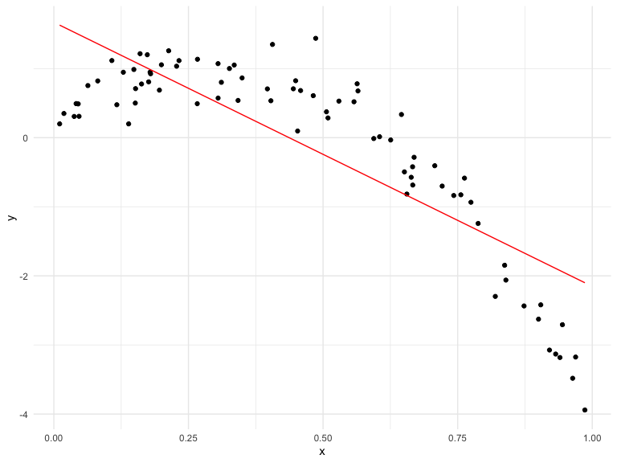

THE BEST:balance model complexity with good fit

``` r
## smooth_mod
train_df %>% 
  add_predictions(smooth_mod) %>% 
  ggplot(aes(x = x, y = y)) +
  geom_point() +
  geom_line(aes(y = pred), color = "red")
```

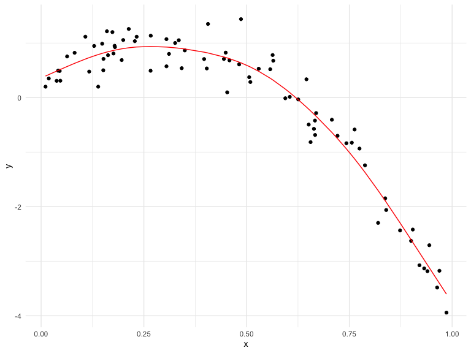

``` r
## wiggly_mod
train_df %>% 
  add_predictions(wiggly_mod) %>% 
  ggplot(aes(x = x, y = y)) +
  geom_point() +
  geom_line(aes(y = pred), color = "red")
```

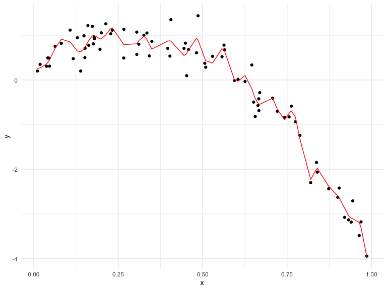

Let’s make predictions and compute RMSEs.

``` r
## shortcut: adding predictions, doing the difference between true y and predictions, calculating rmse
## lower rmse(prediction error) is better
rmse(linear_mod, test_df)
```

    ## [1] 0.7673088

``` r
rmse(smooth_mod, test_df)
```

    ## [1] 0.2840897

``` r
rmse(wiggly_mod, test_df)
```

    ## [1] 0.3452277

## Can we iterate …?

``` r
cv_df =
  crossv_mc(nonlin_df, 100) %>% ## for each resampling, creating a train df and a test df
  mutate(
    train = map(train, as_tibble), ## convert every single one of the resampled objects to a df  
    test = map(test, as_tibble)
  ) %>% 
  mutate(
    linear_fits = map(.x = train, ~lm(y ~ x, data = .x)), ##~lm says you should be looking for .x somewhere
    smooth_fits = map(.x = train, ~mgcv::gam(y ~ s(x), data = .x)),
    wiggly_fits = map(.x = train, ~mgcv::gam(y ~ s(x, k = 30), sp = 10e-6, data = .x))
  ) %>% 
  mutate(
    rmse_linear = map2_dbl(.x = linear_fits, .y = test, ~rmse(model = .x, data = .y)),
    rmse_smooth = map2_dbl(.x = smooth_fits, .y = test, ~rmse(model = .x, data = .y)),
    rmse_wiggly = map2_dbl(.x = wiggly_fits, .y = test, ~rmse(model = .x, data = .y))
  )

## cv_df %>% pull(train) %>% .[[1]] %>%  as_tibble ## checking train df of the 1st row/resampled object
```

Make a boxplot …

``` r
cv_df %>% 
  select(starts_with("rmse")) %>% 
  pivot_longer(
    everything(),
    names_to = "model",
    values_to = "rmse",
    names_prefix = "rmse_"
  ) %>% 
  ggplot(aes(x = model, y = rmse)) +
  geom_boxplot()
```

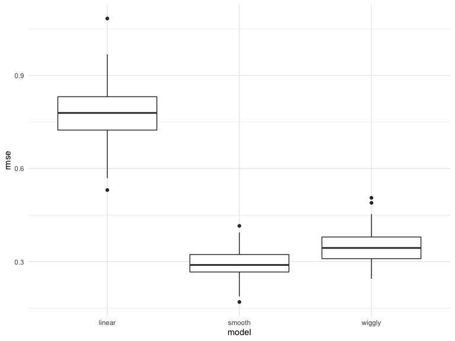

## Try it on a real dataset

``` r
growth_df = read_csv("data/nepalese_children.csv")  
```

    ## Rows: 2705 Columns: 5
    ## ── Column specification ────────────────────────────────────────────────────────
    ## Delimiter: ","
    ## dbl (5): age, sex, weight, height, armc
    ## 
    ## ℹ Use `spec()` to retrieve the full column specification for this data.
    ## ℹ Specify the column types or set `show_col_types = FALSE` to quiet this message.

``` r
growth_df %>%   
  ggplot(aes(x = weight, y = armc)) +
  geom_point(alpha = 0.3)
```

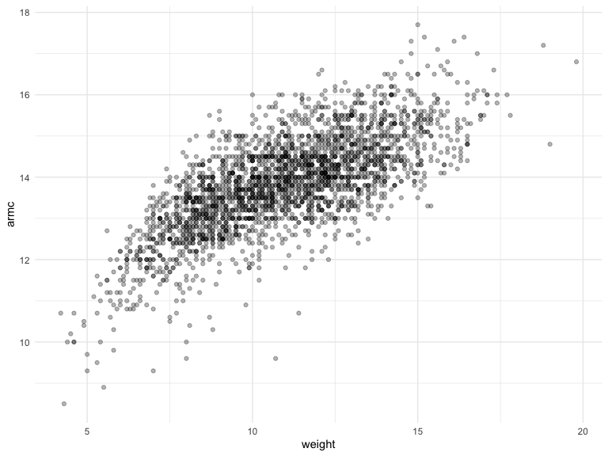

Brief aside on piecewise linear models.

``` r
growth_df = 
  growth_df %>% 
  mutate(
    weight_pwl = (weight > 7) * (weight - 7)
  )
```

``` r
linear_model = lm(armc ~ weight, data = growth_df)
pwl_model = lm(armc ~ weight + weight_pwl, data = growth_df)
smooth_model = mgcv::gam(armc ~ s(weight), data = growth_df)
```

``` r
growth_df %>% 
  add_predictions(pwl_model) %>% 
  ggplot(aes(x = weight, y = armc)) +
  geom_point(alpha = 0.3) +
  geom_line(aes(y = pred), color = "red")
```

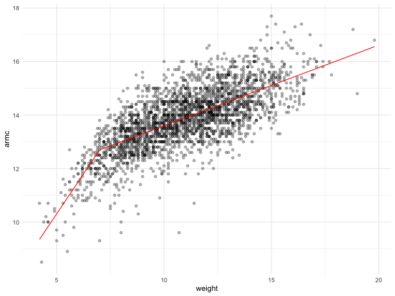

``` r
growth_df %>% 
  add_predictions(linear_model) %>% 
  ggplot(aes(x = weight, y = armc)) +
  geom_point(alpha = 0.3) +
  geom_line(aes(y = pred), color = "red")
```

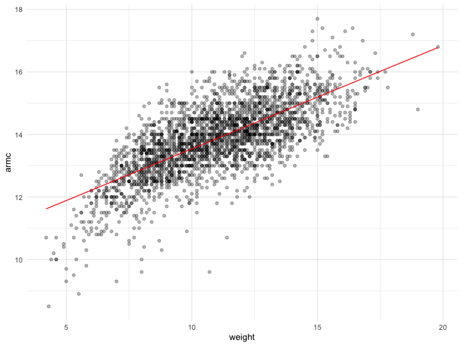

``` r
growth_df %>% 
  add_predictions(smooth_model) %>% 
  ggplot(aes(x = weight, y = armc)) +
  geom_point(alpha = 0.3) +
  geom_line(aes(y = pred), color = "red")
```

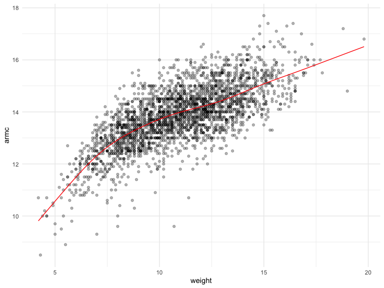

Compare three models using cross validation

``` r
cv_df =
  crossv_mc(growth_df, 100) %>% ## given 1 dataset, compute 100 different train,test splits
  mutate(
    train = map(train, as_tibble), 
    test = map(test, as_tibble)
  )%>% 
  mutate(
    linear_fits = map(.x = train, ~lm(armc ~ weight, data = .x)), 
    pwl_fits    = map(.x = train, ~lm(armc ~ weight + weight + weight_pwl, data = .x)),
    smooth_fits = map(.x = train, ~mgcv::gam(armc ~ s(weight), data = .x))
  ) %>% 
  mutate(
    rmse_linear = map2_dbl(.x = linear_fits, .y = test, ~rmse(model = .x, data = .y)),
    rmse_pwl    = map2_dbl(.x = pwl_fits,    .y = test, ~rmse(model = .x, data = .y)),
    rmse_smooth = map2_dbl(.x = smooth_fits, .y = test, ~rmse(model = .x, data = .y))
  )
```

``` r
cv_df %>% 
  select(starts_with("rmse")) %>% 
  pivot_longer(
    everything(),
    names_to = "model",
    values_to = "rmse",
    names_prefix = "rmse_"
  ) %>% 
  ggplot(aes(x = model, y = rmse)) +
  geom_boxplot()
```

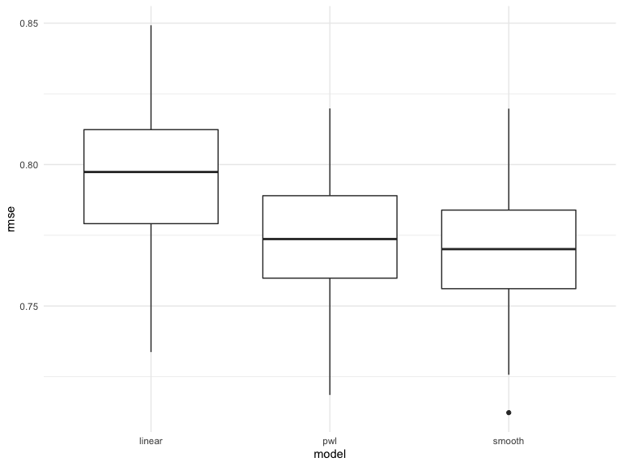
